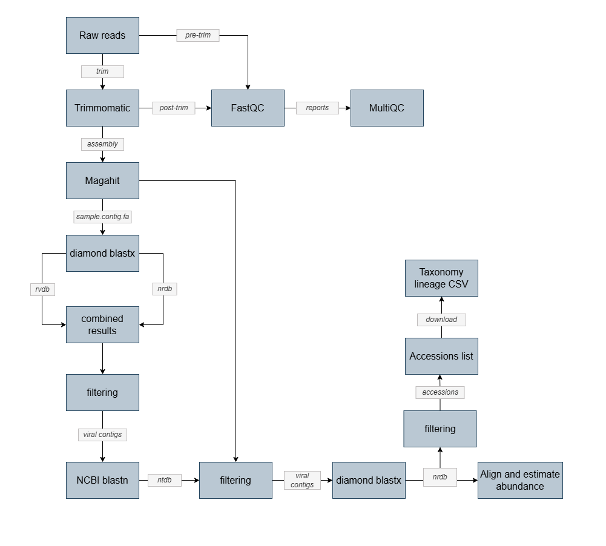

<b><h1>VDM_workshop_2025_practical</h1></b>

<h3>Virus discovery pipeline</h3>
<i>created by</i> Erin Harvey, Carla Mavian, Nokuzotha Nkiwane, TJ Sanko, Eduan Wilkinson.
<i>(in alphabetical order)</i>

<b><h3>Metagenomic Workflow</h3></b>
In this tutorial we will learn how to taxonomically classify and visualize our metagenomic reads obtained with Illumina using the following programs:
<list>
1. [FastQC](https://www.bioinformatics.babraham.ac.uk/projects/fastqc/)
2. [Trimmomatic](https://github.com/usadellab/Trimmomatic)
3. [MEGAHIT](https://www.metagenomics.wiki/tools/assembly/megahit)
4. [Diamond](https://github.com/bbuchfink/diamond?tab=readme-ov-file)
5. [NCBI BLAST](https://www.ncbi.nlm.nih.gov/books/NBK569861/)
6. [seqkit](https://bioinf.shenwei.me/seqkit/)
7. [RSEM](https://github.com/deweylab/RSEM) and [TRINITY](https://github.com/trinityrnaseq/trinityrnaseq/wiki)
</list>
These programs can be installed under conda environment:

1. Install [Miniconda](https://www.anaconda.com/docs/getting-started/miniconda/install)
2. Create conda environment:
   <pre><code>conda create -n viral_discovery -c bioconda -c conda-forge python=3.12 rsem trinity samtools=1.21 bowtie2 trimmomatic fastqc megahit diamond blast seqkit</code></pre>
4. activate the environment in the scripts:
   <pre><code>ON='conda activate viral_discovery' && eval ${ON}</code></pre>

<figure>
    
    <figcaption><b>Figure 1.</b> Virus discovery pipeline Workflow by Nokuzotha Nkiwane </figcaption>
</figure>

<b><h3>Connecting to the server to run the analysis</h3></b>
MacBook's and Linux computers come with terminal windows as part of the system.
They do not require any additional programs to connect to a server.
On Windows computers, you have to emulate a terminal.
Multiple free programs provide that function, e.g [MobaXterm](https://mobaxterm.mobatek.net/), [putty](https://www.chiark.greenend.org.uk/~sgtatham/putty/latest.html), [GitBash](https://git-scm.com/downloads), [Terminus](https://termius.com/) etc.
Using one of the emulators, open a terminal and connect to host by typing:

<pre><code><h3>ssh username@ceri.samrc.ac.za</h3></code></pre>

List of usernames and passwords is avalable under [USERNAME LIST](https://docs.google.com/spreadsheets/d/1n9_X7WztBnIPJ1bgNOBT3rxLMiI8FbEFKeIVxaJ-FOM/edit?usp=drive_link). The passwords are only valid for <b>next 7 days</b>. 
First time connecting you will be ask if you trust the connection. 
You have to type 'yes' and press enter.
Then you will be asked to provide password.
You will be provided one together with your username at the beginning of the workshop.
<b>Passwords are case sensitive and invisiable when typing !!!</b>
Therefore, it is advisable to copy & paste the password.
Successful connection will print the server's logo on your terminal. 
<i>On average on a server you only have 2-5 tries to type the password after which you'll be blocked for at least 30 minutes.
It is better to close the terminal and open it again and try again after the second failed password try.</i> 

<b><h3>Setting up our folder for the analysis</h3></b>
<ol start=1>
<li>Commands used for orentation on the server</li>
<pre><code></code>pwd</code></pre>
<pre><code>ls</code></pre>
<pre><code>ls -Fal *</code></pre>
<pre><code>ll *</code></pre>

<li>Moving around on the server</li>
<pre><code>cd</code></pre>
<pre><code>cd ..</code></pre>
<pre><code>cd ../..</code></pre>
<pre><code>cd ~</code></pre>
<pre><code>cd workspace</code></pre>

<li>Absolute vs relative path</li>
<pre><code>cd /home/vdw00</code></pre>
<pre><code>cd ../</code></pre>
<pre><code>cd ./vdw00</code></pre>

<li>First step will be creating a working folder in workspace folder and moving into the freshly created directory</li>
<pre><code>cd ~/workspace
mkdir -p metagenomics && cd metagenomics</code></pre>
To check if the location was changed, print working directory
<pre><code>pwd</code></pre>

<li>Next, we will create other folders which will, help keep the analysis sorted</li> 
<pre><code>mkdir -p data results scripts</code></pre>
Then change permissions on all of the directories and in them:
<pre><code>chmod -R a=rwx *</code></pre>
To check if everything was created correctly, list the current directory.
<pre><code>ll *</code></pre>

<li>Let's copy our raw data files</li> 
Usually Data are located online, either in a cloud account or a database accessible via webside address. To download files from website you need to use command <i>wget</i>: 
<code>wget <a href="https://">https://</a></code> 
Unfortunately this command does not work on Google or One Drive links. Data from Github can be downloaded by cloning a github repository: 
<code>git clone <a href="github.com">github.com</a></code> 
Our data are already on the server and you can copy them to the designated location:
<pre><code>cp -R /analyses/vdworkshop/data/* ./data </code></pre>
Then change permission on the files and confirm the change on the data in the location:
<pre><code>chmod a=rwx ./data/*
ll ./data/*</code></pre>
</ol>

<b><h3>Analysis</h3></b>
In this section we will create scripts to be executed on each step. The steps will be run form <code>\~/workspace/metagenomics</code> location while the scripts will be located in <code>\~/workspace/metagenomics/scripts</code> directory.
<pre><code>cd ~/workspace/metagenomics</code></code></pre>
(<i>if you get lost, you can use the absolute path:</i> <code>/analyses/vdworkshop/${USER}/metagenomics</code>)  
We will use <i>nano</i> text editor to creat all scripts. You can create empty file and open it to edit at the same time
<pre><code>nano scripts/[script_name].sh</code></pre>
<i>you can copy & paste the script text directly into the open document.</i> 
To save any of your scripts, press ctrl+X then Y and ENTER. This will "override" the [script_name].sh (which was empty on opening) 
You can change the name after pressing 'Y'.Before running the script you have to change permissions
<pre><code>chmod a=rwx scripts/[script_name].sh</code></pre>
To run the script type:
<pre><code>bash scripts/[script_name].sh</code></pre> 

<ol start=1>
<h4><li>FastQC pre-Trimmomatic</li></h4>
<pre><code>nano scripts/01.fastqc_pretrim.sh</code></pre>
	
<pre><code>#!/bin/env bash

THR=5
### enabling conda environment and fastqc program
ON="module miniconda && conda activate fastqc"
eval $ON

### input and output directories
workdir=`realpath $(pwd) 2>/dev/null`
input=${workdir}'/data/fastq'
output=${workdir}'/results/01.fastqc_pretrim'

### make output directory if it doesn't exist
if ! [[ -d ${output} ]]; then mkdir -p -m a=rwx ${output}; fi

echo '[INFO] Running FastQC pre-trim'

### run fastqc
fastqc -t ${THR} -o ${output}/ ${input}/*.f*q*
echo -e "\n[DONE] Pretrim FastQC complete"

### deactivating fastqc program
OFF='conda deactivate'
eval ${OFF}

chmod -R a=rwx ${output}
exit 0;</code></pre>
<pre><code>chmod a=rwx scripts/01.fastqc_pretrim.sh</code></pre>
<pre><code>bash scripts/01.fastqc_pretrim.sh</code></pre>

<h4><li>Trimmomatic</li></h4>
<pre><code>nano scripts/02.trimmomatic.sh</code></pre> 

<pre><code>#!/bin/env bash

THR=5
### activating program
ON='module trimmomatic 1>/dev/null 2>/dev/null'
eval ${ON}

workdir=`realpath $(pwd) 2>/dev/null`
input=${workdir}'/data/fastq'
output=${workdir}'/results/02.trim_output'
ADAPTERS=${workdir}'/data/adapters.fa'

### make output directory if it doesn't exist
if [[ ! -e ${output} ]]; then mkdir -p ${output}; fi

### getting the SRA IDs and creating output files
for FOW in $(ls ${input}/*.f*q* | grep -Ei "_r?1"); do
  REV=`echo ${FOW} | sed -r 's/\_(r|R)?1/\_\12/'`;
  ID=`basename ${FOW} | cut -d '_' -f1`
  P1=${output}/${ID}'_1.P.fq.gz'
  U1=${output}/${ID}'_1.U.fq.gz'
  P2=${output}/${ID}'_2.P.fq.gz'
  U2=${output}/${ID}'_2.U.fq.gz'

  ### running program
  echo "[INFO] trimming: ${ID}"
  trimmomatic PE -threads ${THR} -phred33 -summary ${output}/${ID}'_statsSummary.txt' \
    ${FOW} ${REV} ${P1} ${U1} ${P2} ${U2} \
    ILLUMINACLIP:"${ADAPTERS}":2:30:10 LEADING:5 TRAILING:5 SLIDINGWINDOW:4:5 MINLEN:25 \
    2>>${output}/${ID}.log 1>>${output}/${ID}.log

  echo "[DONE] Trimming for ${ID} complete"
done
chmod -R a=rwx ${output}
exit 0;</code></pre>
<pre><code>chmod a=rwx  scripts/02.trimmomatic.sh</code></pre>
<pre><code>bash scripts/02.trimmomatic.sh</code></pre>

<h4><li>FastQC post-Trimmomatic</li></h4>
<pre><code>nano scripts/03.fastqc_posttrim.sh</code></pre>

<pre><code>#!/bin/env bash

THR=5
### enabling conda environment and fastqc program
ON="module miniconda && conda activate fastqc 1>/dev/null 2>/dev/null"
eval $ON

### input and output directories
workdir=`realpath $(pwd) 2>/dev/null`
input=${workdir}'/results/02.trim_output'
output=${workdir}'/results/03.fastqc_posttrim'

### make output directory if it doesn't exist
if ! [[ -d ${output} ]]; then mkdir -p -m a=rwx ${output}; fi

echo '[INFO] Running FastQC post-trim'

### run fastqc
fastqc -t ${THR} -o ${output}/ ${input}/*.P.fq.gz
echo -e "\n[DONE] Post-trim FastQC complete\n"

### deactivating fastqc program
OFF='conda deactivate'
eval ${OFF}

chmod -R a=rwx ${output}
exit 0;</code></pre>
<pre><code>chmod a=rwx  scripts/03.fastqc_posttrim.sh</code></pre>
<pre><code>bash scripts/03.fastqc_posttrim.sh</code></pre>

<h4><li>MultiQC</li></h4>
<pre><code>nano scripts/04.multiqc.sh</code></pre>

<pre><code>#!/bin/env bash

THR=5
### enabling conda environment and fastqc program
ON="module miniconda && conda activate fastqc 1>/dev/null 2>/dev/null"
eval $ON

### input and output directories
workdir=`realpath $(pwd) 2>/dev/null`
input_pre=${workdir}'/results/01.fastqc_pretrim'
input_post=${workdir}'/results/03.fastqc_posttrim'
output=${workdir}'/results/04.multiqc'

### make output directory if it doesn't exist
if ! [[ -d ${output} ]]; then mkdir -p -m a=rwx ${output}; fi

echo '[INFO] Runnig multiqc'
### to join both results
#multiqc ${input_pre} ${input_post} -o ${output}

multiqc ${input_pre}  -o ${output}/multiqc_pretrim
multiqc ${input_post} -o ${output}/multiqc_posttrim

### deactivating multiqc program
OFF='conda deactivate'
eval ${OFF}

echo -e "\n[INFO] Compressing the results\n"
zip -9r ${output}/multiqc_pretrim.zip ${output}/multiqc_pretrim
zip -9r ${output}/multiqc_posttrim.zip ${output}/multiqc_posttrim

chmod -R a=rwx ${output}
exit 0;</code></pre>
<pre><code>chmod a=rwx  scripts/04.multiqc.sh</code></pre>
<pre><code>bash scripts/04.multiqc.sh</code></pre>

<h4><li>Megahit</li></h4>
<pre><code>nano scripts/05.megahit.sh</code></pre>

<pre><code>#!/bin/env bash

THR=5
### enabling conda environment and megahit program
ON="module miniconda && conda activate megahit 1>/dev/null 2>/dev/null"
eval $ON

### input and output directories
workdir=`realpath $(pwd) 2>/dev/null`
input=${workdir}'/results/02.trim_output'
output=${workdir}'/results/05.megahit'

### make output directory if it doesn't exist
if ! [[ -d ${output} ]]; then mkdir -p -m a=rwx ${output}; fi

### run megahit
for FOW in $(ls ${input}/*_1.P.fq.gz); do
  REV=`echo ${FOW} | sed -r 's/\_(r|R)?1/\_\12/'`;
  ID=`basename ${FOW} | cut -d '_' -f1`
  LOG=${output}/${ID}.log

  echo "[INFO] assembling: ${ID}"
  megahit -t ${THR} -1 ${FOW} -2 ${REV} -o ${output}/${ID} 1>${LOG} 2>${LOG}

  ### after megahit run, prepend sample name to contigs
  ### (allows easier tracking of which contigs came from which sample in downstream analysis)
  awk -v prefix="${ID}_" '/^>/ {$0=">" prefix substr($0,2)} {print}
    ' ${output}/${ID}/final.contigs.fa > ${output}/${ID}/${ID}.contigs.fasta

  echo '[INFO] Cleaning results' && sleep 1s
  rm -Rf ${output}/${ID}/intermediate_contigs 2>/dev/null
  ln -s  ${output}/${ID}/${ID}.contigs.fasta  ${output}/${ID}.contigs.fasta
  echo "[DONE] Megahit assmebly completed successfully and contigs named with sample name: ${ID}" && sleep 1s
done

### deactivating megahit program
OFF='conda deactivate'
eval ${OFF}

chmod -R a=rwx ${output}
exit 0;</code></pre>
<pre><code>chmod a=rwx scripts/05.megahit.sh</code></pre>

<pre><code>bash scripts/05.megahit.sh</code></pre>

<h4><li>Diamond</li></h4>
<ol start=i>
<li>Filtering viral sequences from RVDB protein database</li>
<pre><code>nano scripts/06.1.diamond_rvdb.sh</code></pre>

<pre><code>#!/bin/env bash
THR=5
### enabling diamond program
ON="module diamond 1>/dev/null 2>/dev/null"
eval $ON

### input and output directories
workdir=`realpath $(pwd) 2>/dev/null`
input=${workdir}'/results/05.megahit'
output=${workdir}'/results/06.1.diamond_rvdb'
input_db=${workdir}'/data/database'

### DB variables and directories
FASTA="${input_db}/U-RVDBv30.0-prot.fasta"
DB='RVDB'
if [[ ! -e ${FASTA} && -e ${FASTA}.xz ]]; then xz -dk -T ${THR} ${FASTA}.xz; fi

### make output directory if it doesn't exist
if ! [[ -d ${output} ]]; then mkdir -p -m a=rwx ${output}; fi

### make diamond protein database
echo '[INFO] Reading database file '{$DB}
if [[ ! -e ${input_db}/${DB}.dmnd ]]; then
  diamond makedb --in ${FASTA} --threads ${THR} -d ${input_db}/${DB}; fi
chmod a=rwx ${input_db}/${DB}.dmnd 2>/dev/null

### loop through each of the files created in megahit output directory
### to find final.contigs.fa files and run diamond
function DBLX {
 FOLDER=$1; OUT=$2; DB=$3; T=$4; DBDIR=$5;
  ID=$(basename $1)
  CONTIGS=${FOLDER}/${ID}.contigs.fasta
  LOG=${OUT}/${ID}.log

  if [[ -f ${CONTIGS} ]]; then
	echo "[INFO] Analyzing sample ${ID}"
    sample_out=${OUT}/${ID}_rvdb.blastx
    diamond blastx -d ${DBDIR}/${DB}.dmnd \
    -q ${CONTIGS} \
    --out ${sample_out} \
    --threads ${T} \
    --evalue 1e-5 \
    --outfmt 6 qseqid qlen sseqid stitle pident length evalue bitscore \
    --id 80 \
    --strand both \
    --unal 0 \
    --mp-init 1>${LOG} 2>${LOG}
  else
    echo "[WARNING] Contigs file for ${ID} not found."
  fi
}
export -f DBLX

### check and run in parallel
PARALLEL_VER=(`parallel --version | grep 'GNU parallel'`)
if [[ ${PARALLEL_VER[2]} =~ [0-9]+ ]]; then
 echo '[INFO] Starting parallel mode' && sleep 1s
 ls -dl ${input}/* | grep ^d | awk '{print $9}' | parallel -j ${THR} -n1 -I% "DBLX %" ${output} ${DB} 1 ${input_db}
else
 echo '[INFO] Starting non-parallel mode' && sleep 1s
 for FOLDER in $(ls -dl ${input}/* | grep ^d | awk '{print $9}'); do
  DBLX ${FOLDER} ${output} ${DB} 1 ${input_db}
 done
fi

chmod -R a=rwx ${output}
exit 0;</code></pre>
<pre><code>chmod a=rwx scripts/06.1.diamond_rvdb.sh</code></pre>
<pre><code>bash scripts/06.1.diamond_rvdb.sh</code></pre>

<li>Filtering viral sequences from NCBI protein database</li> 
<pre><code>nano scripts/06.2.diamond_nrdb.sh</code></pre>

<pre><code>#!/bin/env bash

THR=5
### enabling diamond program
ON="module diamond 1>/dev/null 2>/dev/null"
eval $ON

### input and output directories
workdir=`realpath $(pwd) 2>/dev/null`
input=${workdir}'/results/05.megahit'
output=${workdir}'/results/06.2.diamond_nrdb'
input_db=${workdir}'/data/database'

### DB variables and directories
FASTA="${input_db}/nr.faa"
DB='NRDB'
if [[ ! -e ${FASTA} && -e ${FASTA}.gz ]]; then gzip -dkf ${FASTA}.gz; fi

### make output directory if it doesn't exist
if ! [[ -d ${output} ]]; then mkdir -p -m a=rwx ${output}; fi

### make diamond protein database
echo '[INFO] Reading database file '{$DB}
if [[ ! -e ${input_db}/${DB}.dmnd ]]; then
  diamond makedb --in ${FASTA} --threads ${THR} -d ${input_db}/${DB}; fi
chmod a=rwx ${input_db}/${DB}.dmnd 2>/dev/null

### loop through each of the files created in megahit output directory
### to find final.contigs.fa files and run diamond
function DBLX {
 FOLDER=$1; OUT=$2; DB=$3; T=$4; DBDIR=$5;
  ID=$(basename $1)
  CONTIGS=${FOLDER}/${ID}.contigs.fasta
  LOG=${OUT}/${ID}.log

  if [[ -f ${CONTIGS} ]]; then
	echo "[INFO] Analyzing sample ${ID}"
    sample_out=${OUT}/${ID}_nrdb.blastx
    diamond blastx -d ${DBDIR}/${DB}.dmnd \
    -q ${CONTIGS} \
    --out ${sample_out} \
    --threads ${T} \
    --evalue 1e-5 \
    --outfmt 6 qseqid qlen sseqid stitle pident length evalue bitscore \
    --id 80 \
    --strand both \
    --unal 0 \
    --mp-init 1>${LOG} 2>${LOG}
  else
    echo "[WARNING] Contigs file for ${ID} not found."
  fi
}
export -f DBLX

### check and run in parallel
PARALLEL_VER=(`parallel --version | grep 'GNU parallel'`)
if [[ ${PARALLEL_VER[2]} =~ [0-9]+ ]]; then
 echo '[INFO] Starting parallel mode' && sleep 1s
 ls -dl ${input}/* | grep ^d | awk '{print $9}' | parallel -j ${THR} -n1 -I% "DBLX %" ${output} ${DB} 1 ${input_db}
else
 echo '[INFO] Starting non-parallel mode' && sleep 1s
 for FOLDER in $(ls -dl ${input}/* | grep ^d | awk '{print $9}'); do
  DBLX ${FOLDER} ${output} ${DB} 1 ${input_db}
 done
fi

chmod -R a=rwx ${output}
exit 0;</code></pre>
<pre><code>chmod a=rwx scripts/06.2.diamond_nrdb.sh</code></pre>
<pre><code>#bash scripts/06.2.diamond_nrdb.sh</code></pre>
<i>Running this step will take few to several hours. Therefore, to save time we will copy the results of this step from backup location</i>
<pre><code>cp -R ../../backup/results/06.2.diamond_nrdb ./results/</code></pre>
</ol>

<li>Combining results from both blastx searches</li> 

<pre><code>nano scripts/07.combine.sh</code></pre>

<pre><code>#!/bin/env bash

THR=5
### input and output directories
workdir=`realpath $(pwd) 2>/dev/null`
input=${workdir}'/results/05.megahit'
output=${workdir}'/results/07.combine'
rvdb_in=${workdir}'/results/06.1.diamond_rvdb'
nrdb_in=${workdir}'/results/06.2.diamond_nrdb'
contigs_in=${workdir}'/results/05.megahit'

combined_dir="${workdir}/results/07.combined"
### make output directory if it doesn't exist
if ! [[ -d ${combined_dir} ]]; then mkdir -p -m a=rwx ${combined_dir}; fi

rvdb_out=${combined_dir}'/combined_rvdb.blastx'
nrdb_out=${combined_dir}'/combined_nr.blastx'
rvdb_virus=${combined_dir}'/combined_rvdb.virus_hits.blastx'
nrdb_virus=${combined_dir}'/combined_nrdb.virus_hits.blastx'
unique=${combined_dir}'/unique_viral_contigs.txt'
combined_contigs=${combined_dir}'/all_contigs.fasta'
viral_fasta=${combined_dir}'/viral_contigs.fasta'

echo "[INFO] Concatenating all contigs..."
cat ${contigs_in}/*.contigs.fasta > ${combined_contigs}

echo "[INFO] Concatenating RVDB blastx results..."
cat ${rvdb_in}/*_rvdb.blastx > ${rvdb_out}

echo "[INFO] Concatenating VP blastx results..."
cat ${nrdb_in}/*_nrdb.blastx > ${nrdb_out}

echo "[INFO] Filtering for viral hits..."
grep -Ei "vir[us|idae|oid]" ${rvdb_out} > ${rvdb_virus}
grep -Ei "vir[us|idae|oid]" ${nrdb_out} > ${nrdb_virus}

echo "[INFO] Extracting unique contig names..."
awk '{print $1}' ${rvdb_virus} ${nrdb_virus} | sort -u > ${unique}

### Activate seqkit environment
ON="module miniconda && conda activate seqkit 1>/dev/null 2>/dev/null"
eval ${ON}

echo "[INFO] Extracting viral contigs using seqkit..."
seqkit grep -f ${unique} ${combined_contigs} > ${viral_fasta}

OFF='conda deactivate'
eval ${OFF}

echo -en "
[DONE]
Combined RVDB blastx     : ${rvdb_out}
Combined NRDB blastx     : ${nrdb_out}
RVDB viral hits          : ${rvdb_virus}
NRDB viral hits          : ${nrdb_virus}
Unique viral contigs list: ${unique}
Viral contigs FASTA      : ${viral_fasta}
"

echo "[COUNT] Number of viral contigs extracted:"`grep -Ec "^>" ${viral_fasta}`

exit 0;</code></pre>
<pre><code>chmod a=rwx scripts/07.combine.sh</code></pre>
<pre><code>bash scripts/07.combine.sh</code></pre>

<li>Filtering viral sequences from NCBI nucleotide database</li> 
<pre><code>nano scripts/08.ncbi_ntdb.sh</code></pre>

<pre><code>#!/bin/env bash

THR=5
###enabling BLAST program
ON='module ncbi'
eval ${ON}

### input and output directories
workdir=`realpath $(pwd) 2>/dev/null`
input=${workdir}'/results/07.combined/viral_contigs.fasta'
output=${workdir}'/results/08.ncbi_ntdb'
input_db=${workdir}'/data/database'

### DB variables and directories
DB='ntdb'
if [[ ! -e ${input_db}/${DB}/${DB}.nal ]]; then
  echo '[INFO] Indexing nucleotide NCBI database'
  makeblastdb -out ${input_db}/${DB}/${DB} -dbtyp 'nucl' -parse_seqids -n ${input_db}/${DB}/${DB}.fasta -input_type 'fasta'; fi

###make output directory if it doesn't exist
if ! [[ -d ${output} ]]; then mkdir -p -m a=rwx ${output}; fi

echo -en "
Running BLASTN against nt database...
Query: ${input}
DB:    ${DB}
"

blastn \
    -db ${input_db}/${DB}/${DB} \
    -query ${input} \
    -out ${output}'/viral_contigs_vs_nt.blastn' \
    -num_threads ${THR} \
    -evalue 1e-10 \
    -max_target_seqs 25 \
    -outfmt "6 qseqid qlen sseqid stitle pident length mismatch gapopen qstart qend sstart send evalue bitscore" \
    > ${output}/blastn.log 2>&1

chmod -R a+rwx ${output}

echo -en "
BLASTN complete.
Results written to: ${output}/viral_contigs_vs_nt.blastn
Log               : ${output}/blastn.log
"
exit 0;</code></pre>
<pre><code>chmod a=rwx scripts/08.ncbi_ntdb.sh</code></pre>
<pre><code>#bash scripts/08.ncbi_ntdb.sh</code></pre>
<i>Running this step will take few to several hours. Therefore, to save time we will copy the results of this step from backup location</i>
<pre><code>cp -R ../../backup/results/08.ncbi_ntdb ./results/</code></pre>

<li>Combining and filtering sequences from NCBI nucleotide database</li> 
<pre><code>nano scripts/09.blastn_filtered.sh</code></pre>

<pre><code>#!/bin/env bash

THR=5
### input and output directories
workdir=`realpath $(pwd) 2>/dev/null`
blast_in=${workdir}'/results/08.ncbi_ntdb'
output=${workdir}'/results/09.blastn_filtered'
combined_contigs=${workdir}'/results/07.combined/all_contigs.fasta'

virus_hits_list=${output}'/combined_blastn.virus_hits.blastn'
unique_ids=${output}'/unique_ncbi_ntdb_contigs.txt'
viral_fasta=${output}'/viral_contigs_blastn.fasta'

### make output directory if it doesn't exist
if ! [[ -d ${output} ]]; then mkdir -p -m a=rwx ${output}; fi

echo "[INFO] Filtering BLASTn outputs for viral hits..."

### Combine and filter
cat ${blastn_in}/*.blastn | grep -Ei "vir[us|idae|oid]" > ${virus_hits_list}

echo "[INFO] Extracting unique contig IDs..."
awk '{print $1}' ${virus_hits_list} | sort -u > ${unique_ids}

echo "[COUNT] Number of unique viral contigs: "`cat ${unique_ids} | wc -l`

### Activate seqkit
ON="module miniconda && conda activate seqkit 1>/dev/null 2>/dev/null"
eval "${ON}"

echo "[INFO] Extracting viral contigs using seqkit..."
seqkit grep -j ${THR} -f ${unique_ids} ${combined_contigs} > ${viral_fasta}

OFF='conda deactivate'
eval ${OFF}

echo -en "
[DONE]
Viral hits table   : ${virus_hits_list}
Unique contig list : ${unique_ids}
Viral contigs FASTA: ${viral_fasta}
Output directory   : ${output}
"
exit 0;</code></pre>
<pre><code>chmod a=rwx scripts/09.blastn_filtered.sh</code></pre>
<pre><code>bash scripts/09.blastn_filtered.sh</code></pre>

<li>Combining and filtering sequences from NCBI nucleotide database</li> 

<pre><code>nano scripts/10.diamond_blastx_blastn_contigs.sh</code></pre>
<pre><code>#!/bin/env bash

THR=5
### enabling diamond program
ON="module diamond 1>/dev/null 2>/dev/null"
eval $ON

### input and output directories
workdir=`realpath $(pwd) 2>/dev/null`
input=${workdir}'/results/09.blastn_filtered/viral_contigs_blastn.fasta'
output=${workdir}'/results/10.diamond_blastx_blastn_contigs'
input_db=${workdir}'/data/database'

### DB variables and directories
FASTA="${input_db}/nr.faa"
DB='NRDB'
if [[ ! -e ${FASTA} && -e ${FASTA}.gz ]]; then gzip -dkf ${FASTA}.gzip; fi

### make output directory if it doesn't exist
if ! [[ -d ${output} ]]; then mkdir -p -m a=rwx ${output}; fi

### make diamond protein database
if [[ ! -e ${input_db}/${DB}.dmnd ]]; then
  echo '[INFO] Indexing protein diamond nrdb database'
  diamond makedb --in ${FASTA} --threads ${THR} -d ${input_db}/${DB}; fi
chmod a=rwx ${input_db}/${DB}.dmnd

echo "[INFO] Using existing DIAMOND DB: ${DB}"

echo "[INFO] Running DIAMOND blastx..."
diamond blastx \
    -d ${input_db}/${DB} \
    -q ${input} \
    --out ${output}'/viral_contigs_nrdb.blastx' \
    --threads ${THR} \
    --evalue 1e-5 \
    --max-target-seqs 25 \
    --outfmt 6 qseqid qlen sseqid stitle pident length evalue bitscore \
    --id 80 \
    --strand both \
    --unal 0 \
    2> ${output}'/diamond.log'

echo '[INFO] extracting accession numbers'
cat ${output}/viral_contigs_nrdb.blastx | awk '{print $3}' > ${output}/viral_contigs_nrdb.txt
chmod -R a=rwx ${output}/*

echo -en "
[DONE]
DIAMOND results: ${output}/viral_contigs_nrdb.blastx
ACCESSIONS     : ${output}/viral_contigs_nrdb.txt
Log            : ${output}/diamond.log
"
exit 0;</code></pre>
<pre><code>chmod a=rwx scripts/10.diamond_blastx_blastn_contigs.sh</code></pre>
<pre><code>bash scripts/10.diamond_blastx_blastn_contigs.sh</code></pre>

<li>Fetching taxonomy linage from NCBI nucleotide database</li> 

<pre><code>nano scripts/11.genbank_fetch.sh</code></pre>

<pre><code>#!/bin/env bash

### input and output directories
workdir=`realpath $(pwd) 2>/dev/null`
input=${workdir}'/results/10.diamond_blastx_blastn_contigs'
output=${workdir}'/results/11.genbank_fetch'
gb_final="${output}/11.final_gb.gb"

### make output directory if it doesn't exist
if ! [[ -d ${output} ]]; then mkdir -p -m a=rwx ${output}; fi

echo '[INFO] Creating Perl script to fetch taxonomy';
echo '#!/usr/bin/env perl

use strict;
use warnings;
use LWP::Simple;
use XML::Simple;
use Text::CSV;

### Usage:
###   perl get_taxonomy_lineage.pl accessions.txt output_dir

my $input_file = $ARGV[0] or die "Usage: $0 accessions.txt output_dir\n";
my $output_dir = $ARGV[1] or die "Specify output directory\n";

open(my $in, "<", $input_file) or die "Cannot open $input_file: $!\n";

my $csv = Text::CSV->new({ binary => 1, eol => "\n" });
open(my $out, ">$output_dir/taxonomy_lineage.csv") or die "Cannot write to output file: $!\n";
$csv->print($out, ["Accession", "Organism", "TaxID", "Lineage"]);

while (my $acc = <$in>) {
    chomp $acc;
    next unless $acc;

    print "Processing $acc...\n";

    ### Step 1: Search for accession in protein DB
    my $esearch_url =
      "https://eutils.ncbi.nlm.nih.gov/entrez/eutils/esearch.fcgi?db=protein&term=$acc&retmode=xml";

    my $xml_data = get($esearch_url);
    unless ($xml_data) { warn "  Failed to fetch ESearch for $acc\n"; next; }

    my $xml = eval { XMLin($xml_data) };
    if ($@ || !$xml->{IdList}->{Id}) { warn "  No ID found for $acc\n"; next; }

    my $id = ref($xml->{IdList}->{Id}) eq "ARRAY"
           ? $xml->{IdList}->{Id}[0]
           : $xml->{IdList}->{Id};

    ### Step 2: Fetch ESummary to get TaxID
    my $esummary_url =
      "https://eutils.ncbi.nlm.nih.gov/entrez/eutils/esummary.fcgi?db=protein&id=$id&retmode=xml";

    my $sum_data = get($esummary_url);
    unless ($sum_data) { warn "  Failed to fetch ESummary for $acc\n"; next; }

	my ($taxid) = $sum_data =~ /.*Name="TaxId"[^>]*>(\d+)<\/Item>/;
    unless ($taxid) { warn "  No TaxID found for $acc\n"; next; }

    ### Step 3: Get taxonomy lineage
    my $efetch_url =
      "https://eutils.ncbi.nlm.nih.gov/entrez/eutils/efetch.fcgi?db=taxonomy&id=$taxid&retmode=xml";

    my $tax_data = get($efetch_url);
    unless ($tax_data) { warn "  Failed to fetch taxonomy for TaxID $taxid ($acc)\n"; next; }

    my $tax_xml = eval { XMLin($tax_data) };
    if ($@ || !$tax_xml->{Taxon}) { warn "  Failed to parse taxonomy XML for TaxID $taxid\n"; next; }

    ### Taxon may be array or hash
    my $taxon = $tax_xml->{Taxon};
    $taxon = $taxon->[0] if ref($taxon) eq "ARRAY";

    my $scientific_name = $taxon->{ScientificName} || "N/A";
    my $lineage         = $taxon->{Lineage}        || "N/A";

    ### Save to CSV
    $csv->print($out, [$acc, $scientific_name, $taxid, $lineage]);
}

close $in and close $out;

print "\nDone! Results saved to $output_dir/taxonomy_lineage.csv\n";
' > ${workdir}/scripts/get_taxonomy_lineage.pl
chmod a=rwx ${workdir}/scripts/get_taxonomy_lineage.pl

NOACC=`cat ${input}'/viral_contigs_nrdb.txt' | wc -l`
echo "[INFO] Downloading taxonomy lineage for ${NOACC} accessions"
perl ${workdir}/scripts/get_taxonomy_lineage.pl  ${input}'/viral_contigs_nrdb.txt' ${output}

chmod -R a=rwx ${output}
exit 0;</code></pre>

<pre><code>chmod a=rwx scripts/11.genbank_fetch.sh</code></pre>
<pre><code>bash scripts/11.genbank_fetch.sh</code></pre>

<li>Align and estimate abundance with RSEM</li> 
<pre><code>nano scripts/12.rsem.sh</code></pre>

<pre><code>#!/bin/env bash

THR=5
ON='module miniconda && conda activate rsem'
eval $ON

### input and output directories
workdir=`realpath $(pwd) 2>/dev/null`
input=${workdir}'/results/09.blastn_filtered/viral_contigs_blastn.fasta'
output=${workdir}'/results/12.rsem'
reads=${workdir}'/data/fastq'
assemblies=${workdir}'/results/05.megahit'

### make output directory if it doesn't exist
if ! [[ -d ${output} ]]; then mkdir -p -m a=rwx ${output}; fi

function RUN_RSEM {
  FOW=$1; reads_dir=$2; assembly_dir=$3; out_dir=$4; threads=$5

  REV=`echo ${FOW} | sed -r 's,_(r|R)?1,_\12,'`
  sample=`basename ${FOW} | cut -d '_' -f1`

  contigs="${assembly_dir}/${sample}.contigs.fasta"
  out_prefix="${out_dir}/${sample}.RSEM"

  if [[ ! -f ${contigs} ]]; then
    echo "[WARN] Missing contigs for ${sample}: ${contigs}"
    return
  fi
  if [[ ! -f ${FOW} || ! -f ${REV} ]]; then
    echo "[WARN] Missing reads for ${sample}"
    return
  fi

  echo "[INFO] Running RSEM for ${sample}" && sleep 1s

  ### Run RSEM using Trinity utility
  align_and_estimate_abundance.pl \
        --transcripts ${contigs} \
        --seqType fq \
        --left ${FOW} \
        --right ${REV} \
        --est_method RSEM \
        --aln_method bowtie2 \
        --output_dir ${out_prefix} \
        --thread_count ${threads} \
        --prep_reference \
        > ${out_prefix}'.log' 2>&1

  echo "[DONE] ${sample}"
}
export -f RUN_RSEM

echo "[INFO] Starting RSEM quantification for samples..."
### check and run in parallel
PARALLEL_VER=(`parallel --version | grep 'GNU parallel'`)
if [[ ${PARALLEL_VER[2]} =~ [0-9]+ ]]; then
 echo '[INFO] Starting non-parallel mode' && sleep 1s
 ls -dl ${reads}/*.gz | awk '{print $9}' | grep -Ei '_r?1' | parallel -j ${THR} -n1 -I% "RUN_RSEM %" ${reads} ${assemblies} ${output} 1
else
 echo '[INFO] Starting parallel mode' && sleep 1s
 for FILE in $(ls -dl ${reads}/*.gz | awk '{print $9}' | grep -Ei '_r?1'); do
  RUN_RSEM ${FILE} ${reads} ${assemblies} ${output} 1
 done
fi

OFF='conda deactivate'
eval ${OFF}
chmod -R a=rwx ${output}
exit 0;</code></pre>
<pre><code>chmod a=rwx scripts/12.rsem.sh</code></pre>
<pre><code>bash scripts/12.rsem.sh</code></pre>
