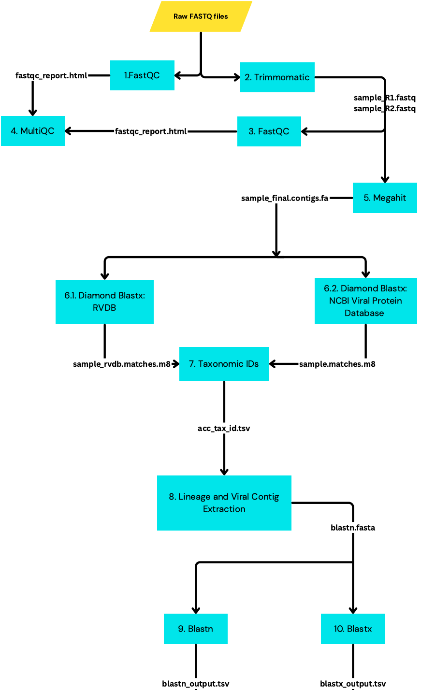

<p><b><h1>VDM_workshop_2025_practical</h1></b></p>
<h3>Virus discovery pipeline</h3>
<i>created by</i> Erin Harvey, Carla Mavian, Nokuzotha Nkiwane, TJ Sanko, Eduan Wilkinson.
<i>(in alphabetical order)</i>

<b><h3>Metagenomic Workflow</h3></b>
In this tutorial we will learn how to taxonomically classify and visualize our metagenomic reads obtained with Illumina using the following programs:
<list>
1. [FastQC](https://www.bioinformatics.babraham.ac.uk/projects/fastqc/)
2. [Trimmomatic](https://github.com/usadellab/Trimmomatic)
3. [MEGAHIT](https://www.metagenomics.wiki/tools/assembly/megahit)
4. [Diamond](https://github.com/bbuchfink/diamond?tab=readme-ov-file)
</list>
<figure>
    
    <figcaption><b>Figure 1.</b> Virus discovery pipeline Workflow by Nokuzotha Nkiwane </figcaption>
</figure>

<b><h3>Connecting to the server to run the analysis</h3></b>
MacBook's and Linux computers come with terminal windows as part of the system.
They do not require any additional programs to connect to a server.
On Windows computers, you have to emulate a terminal.
Multiple free programs provide that function, e.g [MobaXterm](https://mobaxterm.mobatek.net/), [putty](https://www.chiark.greenend.org.uk/~sgtatham/putty/latest.html), [GitBash](https://git-scm.com/downloads), [Terminus](https://termius.com/) etc.
Using one of the emulators, open a terminal and connect to host by typing:

<pre><code>ssh username@ceri.sarmc.ac.za</code></pre>

First time connecting you will be ask if you trust the connection. 
You have to type 'yes' and press enter.
Then you will be asked to provide password.
You will be provided one together with your username at the beginning of the workshop.
<b>Passwords are case sensitive and invisiable when typing !!!</b>
Therefore, it is advisable to copy & paste the password.
Successful connection will print the server's logo on your terminal.<br>
<i>On average on a server you only have 2-5 tries to type the password afterwhich you'll be blocked for at least 30 minutes.
It is better to close the terminal and open it again and try again after the second failed password try.</i><br>

<b><h3>Setting up our folder for the analysis</h3></b>
<ol start=1>
<li>Commands used for orentation on the server</li>
<pre><code></code>pwd</code></pre>
<pre><code>ls</code></pre>
<pre><code>ls -Fal *</code></pre>
<pre><code>ll *</code></pre>

<li>Moving around on the server</li>
<pre><code>cd</code></pre>
<pre><code>cd ..</code></pre>
<pre><code>cd ../..</code></pre>
<pre><code>cd ~</code></pre>
<pre><code>cd workspace</code></pre>

<li>Absolute vs relative path</li>
<pre><code>cd /home/vdw00</code></pre>
<pre><code>cd ../</code></pre>
<pre><code>cd ./vdw00</code></pre>

<li>First step will be creating a working folder in workspace folder and moving into the freshly created directory</li>
<pre><code>cd workspace
mkdir -p metagenomics
cd metagenomics</code></pre>
To check if the location was changed, print working directory
<pre><code>pwd</code></pre>

<li>Next, we will create other folders which will, help keep the analysis sorted</li> 
<pre><code>mkdir -p data results scripts</code></pre>
Then change permissions on all of the directories and in them:
<pre><code>chmod -R a=rwx ./</code></pre>
To check if everything was created correctly, list the current directory.
<pre><code>ll *</code></pre>

<li>Let's go into data directory and copy our files</li><br>
<pre><code>cd data</code></pre>
Downloading files from website:
<pre><code>wget <a href="https://">https://</a></code></pre>
Alternatively, if the internet connection is slow, you can copy the data from backup location:
<pre><code> cp -R /analyses/vdworkshop/.backup/data/* ./ </code></pre>
Then change permission on the files and confirm the change on the data in the location:
<pre><code>chmod a=rwx *
ll *</code></pre>
</ol>

<b><h3>Analysis</h3></b>
<ol start=1>
<h4><li>FastQC pre-Trimmomatic</li></h4>
Let's create a script to execute this step in metagenomics/scripts directory
<pre><code>cd /analyses/vdworkshop/${USER}</code></pre>
or
<pre><code>cd ~/workspace</code></code></pre>
(<i>if you get lost, you can use the absolute path:</i> <code>/analyses/vdworkshop/${USER}/metagenomics</code>)<br><br>

We will use <i>nano</i> text editor to creat all scripts. You can create empty file and open it to edit at the same time
<pre><code>nano scripts/01.fastqc_pretrim.sh</code></pre>
<i>you can copy & paste the script text directly into the open document.</i><br>

<pre><code>#!/bin/env bash

THR=5
### enabling conda environment and fastqc program
ON="module miniconda && conda activate fastqc"
eval $ON

### input and output directories
workdir=`realpath $(pwd) 2>/dev/null`
input=${workdir}'/data/fastq'
output=${workdir}'/results/01.fastqc_pretrim'

### make output directory if it doesn't exist
if ! [[ -d ${output} ]]; then mkdir -p -m a=rwx ${output}; fi

echo 'Running FastQC pre-trim'

### run fastqc
fastqc -t ${THR} -o ${output}/ ${input}/*.f*q*
echo "Pretrim FastQC complete"

### deactivating fastqc program
OFF='conda deactivate'
eval ${OFF}
chmod -R a=rwx ${output}

exit 0;
</code></pre>

To save your script press ctrl+X then Y and ENTER<br>
This will "override" the 01.fastqc_pretrim.sh (which was empty on opening)<br>
You can change the name after pressing Y <br><br>
Before running the script you have to change permissions
<pre><code>chmod a=rwx scripts/01.fastqc_pretrim.sh</code></pre>
To run the script type:
<pre><code>bash scripts/01.fastqc_pretrim.sh</code></pre>

<h4><li>Trimmomatic</li></h4>
Let's create another script for trimmomatic in the same directory<br>
<pre><code>nano scripts/02.trimmomatic.sh</code></pre><br>

<pre><code>#!/bin/env bash

THR=5
### activating program
ON='module trimmomatic 1>/dev/null 2>/dev/null'
eval ${ON}

workdir=`realpath $(pwd) 2>/dev/null`
input=${workdir}'/data/fastq'
output=${workdir}'/results/02.trim_output'
ADAPTERS=${workdir}'/data/adapters.fa'

### make output directory if it doesn't exist
if [[ ! -e ${output} ]]; then mkdir -p ${output}; fi

### getting the SRA IDs and creating output files
for FOW in $(ls ${input}/*.f*q* | grep -Ei "_r?1"); do
  REV=`echo ${FOW} | sed -r 's/\_(r|R)?1/\_\12/'`;
  ID=`basename ${FOW} | cut -d '_' -f1`
  P1=${output}/${ID}'_1.P.fq.gz'
  U1=${output}/${ID}'_1.U.fq.gz'
  P2=${output}/${ID}'_2.P.fq.gz'
  U2=${output}/${ID}'_2.U.fq.gz'

  ### running program
  echo "trimming: ${ID}"
  trimmomatic PE -threads ${THR} -phred33 -summary ${output}/${ID}'_statsSummary.txt' \
    ${FOW} ${REV} ${P1} ${U1} ${P2} ${U2} \
    ILLUMINACLIP:"${ADAPTERS}":2:30:10 LEADING:5 TRAILING:5 SLIDINGWINDOW:4:5 MINLEN:25 \
    2>>${output}/${ID}.log 1>>${output}/${ID}.log

  echo "Trimming for ${ID} complete"
done
chmod -R a=rwx ${output}
exit 0;
</code></pre>

Save your script, change permissions and run the script.<br>
<pre><code>chmod a=rwx  scripts/02.trimmomatic.sh</code></pre>
<pre><code>bash  scripts/02.trimmomatic.sh</code></pre>

<h4><li>FastQC post-Trimmomatic</li></h4>
Open new script:<br>
<pre><code>nano scripts/03.fastqc_posttrim.sh</code></pre>

<pre><code>#!/bin/env bash

THR=5
### enabling conda environment and fastqc program
ON="module miniconda && conda activate fastqc 1>/dev/null 2>/dev/null"
eval $ON

### input and output directories
workdir=`realpath $(pwd) 2>/dev/null`
input=${workdir}'/results/02.trim_output'
output=${workdir}'/results/03.fastqc_posttrim'

### make output directory if it doesn't exist
if ! [[ -d ${output} ]]; then mkdir -p -m a=rwx ${output}; fi

echo 'Running FastQC post-trim'

### run fastqc
fastqc -t ${THR} -o ${output}/ ${input}/*.P.fq.gz
echo "Post-trim FastQC complete"

### deactivating fastqc program
OFF='conda deactivate'
eval ${OFF}

chmod -R a=rwx ${output}

exit 0;
</code></pre>

Save your script, change permissions and run the script.<br>
<pre><code>chmod a=rwx  scripts/03.fastqc_posttrim.sh</code></pre>
<pre><code>bash  scripts/03.fastqc_posttrim.sh</code></pre>

<h4><li>MultiQC</li></h4>
Let's create a script for this step<br>
<pre><code>nano  scripts/04.multiqc.sh</code></pre>

<pre><code>#!/bin/env bash

THR=5
### enabling conda environment and fastqc program
ON="module miniconda && conda activate fastqc 1>/dev/null 2>/dev/null"
eval $ON

### input and output directories
workdir=`realpath $(pwd) 2>/dev/null`
input_pre=${workdir}'/results/01.fastqc_pretrim'
input_post=${workdir}'/results/03.fastqc_posttrim'
output=${workdir}'/results/04.multiqc'

### make output directory if it doesn't exist
if ! [[ -d ${output} ]]; then mkdir -p -m a=rwx ${output}; fi

### runnig multiqc
### this will join both results, we would rather want to keep them separate to compare
#multiqc ${input_pre} ${input_post} -o ${output}

multiqc ${input_pre} -o ${output}/multiqc_pretrim
multiqc ${input_post} -o ${output}/multiqc_posttrim

### deactivating multiqc program
OFF='conda deactivate'
eval ${OFF}

zip -9r ${output}/multiqc_pretrim.zip ${output}/multiqc_pretrim
zip -9r ${output}/multiqc_posttrim.zip ${output}/multiqc_posttrim
chmod -R a=rwx ${output}

exit 0;
</code></pre>

Save your script, change permissions and run the script.<br>
<pre><code>chmod a=rwx  scripts/04.multiqc.sh</code></pre>
<pre><code>bash  scripts/04.multiqc.sh</code></pre>

<h4><li>Megahit</li></h4>
Create new script:<br>
<pre><code>nano  scripts/05.megahit.sh</code></pre>

<pre><code>#!/bin/env bash

THR=5
### enabling conda environment and megahit program
ON="module miniconda && conda activate megahit 1>/dev/null 2>/dev/null"
eval $ON

### input and output directories
workdir=`realpath $(pwd) 2>/dev/null`
input=${workdir}'/results/02.trim_output'
output=${workdir}'/results/05.megahit'

### make output directory if it doesn't exist
if ! [[ -d ${output} ]]; then mkdir -p -m a=rwx ${output}; fi

### run megahit
for FOW in $(ls ${input}/*_1.P.fq.gz); do
  REV=`echo ${FOW} | sed -r 's/\_(r|R)?1/\_\12/'`;
  ID=`basename ${FOW} | cut -d '_' -f1`
  LOG=${output}/${ID}.log

  echo "assembling: ${ID}"
  megahit -t ${THR} -1 ${FOW} -2 ${REV} -o ${output}/${ID} 1>${LOG} 2>${LOG}

  ### after megahit run, prepend sample name to contigs
  ### (allows easier tracking of which contigs came from which sample in downstream analysis)
  awk -v prefix="${ID}_" '/^>/ {$0=">" prefix substr($0,2)} {print}
    ' ${output}/${ID}/final.contigs.fa > ${output}/${ID}/${ID}.contigs.fasta

  echo "Megahit assmebly completed successfully and contigs named with sample name: ${ID}"
done

### deactivating megahit program
OFF='conda deactivate'
eval ${OFF}

chmod -R a=rwx ${output}

exit 0;
</code></pre>

Save your script, change permissions and run the script.<br>
<pre><code>chmod a=rwx  scripts/05.megahit.sh</code></pre>
<pre><code>bash  scripts/05.megahit.sh</code></pre>

<h4><li>Diamond</li></h4>
<ol start=i>
<li>Create new script:</li><br>
<pre><code>nano scripts/06.1.diamond_rvdb.sh</code></pre>

<pre><code>#!/bin/env bash
THR=5
### enabling conda environment and diamond program
ON="module miniconda && conda activate diamond"
eval $ON

### input and output directories
workdir=`realpath $(pwd) 2>/dev/null`
input=${workdir}'/results/05.megahit'
output=${workdir}'/results/06.1.diamond_rvdb'

### DB variables and directories
FASTA="${workdir}/data/diamond/RVDB/v30.0/U-RVDBv30.0-prot.fasta"
DB='RVDB'

### make output directory if it doesn't exist
if ! [[ -d ${output} ]]; then mkdir -p -m a=rwx ${output}; fi

### make diamond protein database
if [[ ! -e ${output}/${DB} ]]; then
  diamond makedb --in ${FASTA} -d ${output}/${DB}; fi

### loop through each of the files created in megahit output directory 
### to find final.contigs.fa files and run diamond
for FOLDER in $(ls -dl ${input}/* | grep ^d | awk '{print $9}'); do
  ID=$(basename ${FOLDER})
  CONTIGS=${FOLDER}/${ID}.contigs.fasta

  ### alignment using blastx
  ### (exclude --min-score because it overrides the evalue (acc. to manual))
  if [[ -f ${CONTIGS} ]]; then
    sample_out=${output}/${${ID}_rvdb.matches.m8
    diamond blastx -d ${output}/${RVDB}.dmnd \
    -q ${CONTIGS} \
    --out ${sample_out} \
    --threads ${THR} \
    --evalue 1E-5 \
    --outfmt "6 qseqid qlen sseqid stitle pident length evalue bitscore" \
    --id 80 \
    --strand both \
    --unal 0 \
    --mp-init 
  else 
    echo "Contigs file for ${ID} not found."
  fi
done

chmod -R a=rwx ${output}

exit 0;
</code></pre>

Save your script, change permissions and run the script.<br>
<pre><code>chmod a=rwx scripts/06.1.diamond_rvdb.sh</code></pre>
<pre><code>bash scripts/06.1.diamond_rvdb.sh</code></pre>

<li>Filtering viral sequencess from NCBI database</li><br>
Create a script for NCBI database:<br>
<pre><code>nano 06.2.ncbidb.sh</code></pre>

<pre><code>#!/bin/env bash

### input and output directories
workdir=`realpath $(pwd) 2>/devnull`'/../'
input=${workdir}'/data/ncbi'
output=${workdir}'/results/06.2.ncbidb'

### variables and directories
input_db=${input}'/nr.faa'
viral_csv=${input}'/virus_taxonomy_lvls.csv'
viral_names=${input}'/viral_names.txt"
DBFASTA=${output}'/ncbi_fasta.fasta'

### make output directory if it doesn't exist
if ! [[ -d ${output} ]]; then mkdir -p -m a=rwx ${output}; fi

### filter csv for viral sequences
awk -F',' '{print $3}' ${viral_csv} >> ${viral_names}

### filter nr database for viral sequences 
while read -r virus; do
    awk -v name="${virus}" '
        BEGIN {IGNORECASE=1}
        /^>/ {ON = index($0, name) > 0}
        ON {print}
    ' ${input_db} >> ${DBFASTA}
done < ${viral_names}
exit 0;
</code></pre>

Save your script, change permissions and run the script.<br>
<pre><code>chmod a=rwx 06.2.ncbidb.sh</code></pre>
<pre><code>bash 06.2.ncbidb.sh</code></pre>

<li>Create another script for diamond using NCBI database:</li><br>
<pre><code>nano 06.3.diamond_ncbi.sh</code></pre>

<pre><code>#!/bin/env bash

THR=5
### enabling conda environment and diamond program
ON="module miniconda && conda activate diamond"
eval $ON

### input and output directories
workdir=`realpath $(pwd) 2>/devnull`'/../'
input_db=${workdir}'/results/06.2.ncbidb'
output=${workdir}'/results/06.3.diamond_ncbi'
DBFASTA=${input_db}'/ncbi_fasta.fasta'
DB='NCBI'
input_reads=${workdir}'/results/05.megahit'

### make output directory if it doesn't exist
if ! [[ -d ${output} ]]; then mkdir -p -m a=rwx ${output}; fi

### make diamond protein database
if [[ ! -e ${output}/${DB} ]]; then
  diamond makedb --in ${DBFASTA} -d ${output}/${DB}; fi

### loop through each of the files created in megahit output directory 
### to find final.contigs.fa files and run diamond
for FOLDER in $(ls -dl ${input_reads}/* | grep ^d | awk '{print $9}'); do
  ID=$(basename ${FOLDER})
  CONTIGS=${FOLDER}/${ID}.contigs.fasta

  ### alignment using blastx
  ### (exclude --min-score because it overrides the evalue (acc. to manual))
  if [[ -f ${CONTIGS} ]]; then
    sample_out=${output}/${${ID}_ncbi.matches.m8
    diamond blastx -d ${output}/${RVDB}.dmnd \
    -q ${CONTIGS} \
    --out ${sample_out} \
    --threads ${THR} \
    --evalue 1E-5 \
    --outfmt "6 qseqid qlen sseqid stitle pident length evalue bitscore" \
    --id 80 \
    --strand both \
    --unal 0 \
    --mp-init 
  else 
    echo "Contigs file for ${ID} not found."
  fi
done

exit 0;
</code></pre>

Save your script, change permissions and run the script.<br>
<pre><code>chmod a=rwx 06.3.diamond_ncbi.sh</code></pre>
<pre><code>bash 06.3.diamond_ncbi.sh</code></pre>
</ol>

<h4><li>Taxonomy</li></h4>
Create new script:<br>
<pre><code>nano 07.taxonomy.sh</code></pre>

<pre><code>#!/bin/env bash

### input and output directories
workdir=`realpath $(pwd) 2>/devnull`'/../'
input=${workdir}'/results/06.3.diamond_ncbi' ####(???)
input_ids=${workdir}/data/acc_ids.txt' ########(???)
output=${workdir}'/results/07.' ###############(???)
output_tsv=${output}'/07.taxonomy.tsv'

### make output directory if it doesn't exist
if ! [[ -d ${output} ]]; then mkdir -p -m a=rwx ${output}; fi

### function to get metadata from eutils
function get_meta {
    contig=$1
    length=$2
    acc_id=$3
    #columns=$4 ###########(???)
    #output=$5
	output=$4

    ### print ncbi page of protein accession and parse taxonomic id for use in taxonkit for lineage
	  b1='https://eutils.ncbi.nlm.nih.gov/entrez/eutils/efetch.fcgi?db='
	  db='protein'
	  b2='&id='
	  b3='&rettype='
	  file_type='gb'
	  b4='&retmode='
	  file_mode='text'
	url="${b1}${db}${b2}${acc_id}${b3}${file_type}${b4}${file_mode}"
    info=$(curl -L --retry 3 --connect-timeout 5 -N -# ${url})
   
	### taxonomic number
    tax=$(echo "${info}" | awk '/\/db_xref/ { match($0, /taxon:([0-9]+)/, tax_id); print tax_id[1] }')

    ### put NA if no taxonomy id found
    if [[ -z "${tax}" ]]; then tax="NA"; fi;

    ### print output
    echo -e "${contig}\t${length}\t${acc_id}\t${rest}\t${tax}" >>"${output}"
    sleep 1s
}
export -f get_meta

### clear output file before each run
rm -f ${output_tsv}

### adding empty line if there is none, else the file will be read incorrectly:
if ! [[ `tail -n1 ${input_ids}` =~ ^$ ]]; then echo >> ${input_ids}; fi

while read -r LN; do
  ### skipping over empyt lines in file
  if [[ `echo ${LN}` =~ ^$ ]]; then ontinue; fi

  ### splitting columns into fixed positions in a list
  unset TMP; declare -a TMP=(${LN})
  echo '['${TMP[2]}']'

  ### creating temporary file
  tmpfile=$(mktemp)

  ### passing arguments to function (list index starts from possition 0)
  get_meta ${TMP[0]} ${TMP[1]} ${TMP[2]} ${tmpfile}

  ### collecting results
  cat ${tmpfile} >>${output_tsv}
  rm -f ${tmpfile}
done <"${input_ids}"

exit 0;
</code></pre>

Save your script, change permissions and run the script.<br>
<pre><code>chmod a=rwx 07.taxonomy.sh</code></pre>
<pre><code>bash 07.taxonomy.sh</code></pre>

<h4><li>Lineage filter</li></h4>
Create new script:<br>
<pre><code>nano 08.lineage_filter.sh</code></pre>

<pre><code>#!/bin/env bash

THR=5
### enabling conda environment and viral_pipeline program
ON="module miniconda && conda activate viral_pipeline" ##############(???)
eval ${ON}

### input and output directories
workdir=`realpath $(pwd) 2>/devnull`'/../'
input=${workdir}'/results/07.taxonomy'
output=${workdir}'/results/08.lineage_filter'

acc_tax_id="${output}/acc_tax_id.tsv"
u_match_out="${output}/unique_contig_ids.txt"
lineage_out="${output}/lineages.tsv"
contig_matches="${output}/contig_matches.tsv"
output_fa="${output}/blast_fasta.fa"
#mega_conts="${workdir}/results/05.megahit/output/default" (####### ???)

for FOLDER in $(ls -dl ${input}/* | grep ^d | awk '{print $9}'); do
  ID=$(basename ${FOLDER})
  CONTIGS=${FOLDER}/${ID}.contigs.fasta

  #fin_fasta=${mega_conts}/*/sample.contigs.fa


  ### clear lineage output files
  if [[ -e ${lineage_out}    ]]; then rm -f ${lineage_out};    touch ${lineage_out};    fi
  if [[ -e ${contig_matches} ]]; then rm -f ${contig_matches}; touch ${contig_matches}; fi
  if [[ -e ${u_match_out}    ]]; then rm -f ${u_match_out};    touch ${u_match_out};    fi
  if [[ -e ${output_fa}      ]]; then rm -f ${output_fa};      touch ${output_fa};      fi

  ### get raw lineage information
  echo "Retrieving lineage information"
  taxonkit lineage -d $'\t' -i 9 ${acc_tax_id} > ${lineage_out}

  ### extract contig matches that are part of viruses
  echo "Extracting contig matches that are part of viruses"
  for LN in $(cat ${lineage_out}); do
    if [[ `echo ${LN}` =~ ^$ ]]; then continue; fi
	if [[ `echo ${LN} | grep -i 'Viruses'` ]]; then echo -e "${LN}\n" >>${contig_matches}; fi
  done
#  while read -r -a fields; do
#    if [[ ${fields[9]} == *Viruses* ]]; then
#        echo "${fields[2]}"
#        printf "%s\t" "${fields[@]}" "\n" >> ${contig_matches}
#        printf "\n" >> ${contig_matches}
#    fi
# done < ${lineage_out}

  ### get unique contig matches
  echo "Extract unique contig matches"
  cat ${contig_matches} | awk '{print $1}' > ${u_match_out}
  sort -u ${u_match_out} -o ${u_match_out}

  ### find the contig matches in the final.contigs.fa file
  echo "Producing final blasta fasta with matches to blast against NT and NR"
  
  while read -r hit; do
    if grep -qF ">${hit}" "${CONTIGS}"; then
        awk -v contig=">${hit}" '
            $0 ~ ("^"contig) {print; ON=1; next}
            ON && /^>/ {exit}
            ON {print}
        ' ${CONTIGS} >> ${output_fa}
    fi

    #progress check
    echo "Sequence for ${hit} found"
  done < "${u_match_out}"
done

exit 0
</code></pre>

Save your script, change permissions and run the script.<br>
<pre><code>chmod a=rwx 08.lineage_filter.sh</code></pre>
<pre><code>bash 08.lineage_filter.sh</code></pre>


##########################################################################
### 9. BlastN

```
cd metagenomics/scripts
nano 09.blastn.sh
```

```
#!/bin/env bash

#load modules
module ncbi
ON="module miniconda && conda activate viral_pipeline"

#directories
wdir="/analyses/users/nokuzothan/disc_pipe"
db_fa="${wdir}/ncbidb/nt/nt"
input_fa="/analyses/users/nokuzothan/Virolocate/work/c4/03b0a4833978dcf7aabea1ab5a3987/final_blast_contig.fasta"
blastn_out="${wdir}/init_tools/play"
output="${blastn_out}/blastn_output_3.tsv"
blastn_tax_tmp_1="${blastn_out}/contig_acc.txt"
blastn_tax_tmp_2="${blastn_out}/contig_acc_tax.txt"
blastn_tax="${blastn_out}/blastn_taxonomy.tsv"
threads=4

# #make blastn_results subdirectory in blastn output folder
# if [[ -e ${blastn_out} ]]; then
#     rm -rf ${blastn_out}
# fi
# mkdir -p -m a=rwx ${blastn_out}

#blastn run
if [[ -s ${input_fa} ]]; then
    echo "Running blastn"
    blastn -query ${input_fa} \
        -db ${db_fa} \
        -out ${output}\
        -strand both \
        -num_threads ${threads} \
        -evalue 1E-5 \
        -outfmt "6 qseqid qlen sseqid stitle pident length qstart qend evalue bitscore" \
        -perc_identity 80 \
        -max_target_seqs 5

else
    echo "Query fasta file of samples does not exist or is empty, skipping blastn."
fi


#extract contigs ids and accession numbers from blastn_output.tsv

#get taxonomic ids
function get_meta {
    contig=$1
    length=$2
    acc_id=$3
    columns=$4
    output=$5

    #progress check
    echo "Fetching metadata for "${acc_id}""
    #print ncbi page of protein accession and parse taxonomic id for use in taxonkit for lineage
    url1="https://eutils.ncbi.nlm.nih.gov/entrez/eutils/efetch.fcgi?db=protein&id=${acc_id}&rettype=gb&retmode=text"
    info=$(curl -N -# ${url1})

    #host source, gographical location name, collection date, gene, product, taxonomic number
    host=$(echo "${info}" | awk -F'"' '/\/host/ {print $2}')
    geo_loc_name=$(echo "${info}" | awk -F'"' '/\/geo_loc_name/ {print $2}')
    date=$(echo "${info}" | awk -F'"' '/\/collection_date/ {print $2}')
    gene=$(echo "${info}" | awk -F'"' '/\/coded_by/ {print $2}')
    product=$(echo "${info}" | awk -F'"' '/\\/product/ {print $2}')
    tax=$(echo "${info}" | awk '/\/db_xref/ { match($0, /taxon:([0-9]+)/, tax_id); print tax_id[1] }')

    #put NA if any of the fields are empty
    if [[ -z "${host}" ]]; then
        host="NA"
    fi

    if [[ -z "${geo_loc_name}" ]]; then
        geo_loc_name="NA"
    fi

    if [[ -z "${date}" ]]; then
        date="NA"
    fi

    if [[ -z "${gene}" ]]; then
        gene="NA"
    fi

    if [[ -z "${product}" ]]; then
        product="NA"
    fi

    if [[ -z "${tax}" ]]; then
        tax="NA"
    fi

    #print output
    echo -e "${contig}\t${length}\t${acc_id}\t${rest}\t${host}\t${gene}\t${product}\t${geo_loc_name}\t${date}\t${tax}" >>${output}
}

while IFS=$'\t' read -r col1 col2 col3 rest;do
    acc=$(echo "[\${col3}]" | cut -d '|' -f2)
    get_meta "${col1}" "${col2}" "${acc}" "${rest}" "blastn_metadata.tsv"
done < "${output}"

#get lineage information
eval ${ON}

#progress check
echo "Getting taxonomic lineage information"

taxonkit lineage -d $'\t' -i 10 ${blastn_tax_tmp_2} >> ${blastn_tax}
conda deactivate

#remove temp file
rm ${blastn_tax_tmp_1}
rm ${blastn_tax_tmp_2}

```

### 10. BlastX

```
cd metagenomics/scripts
nano 10.blastx.sh
```

```
#!/bin/env bash

#load module
module diamond

# variables and directories
wdir="/analyses/users/nokuzothan/disc_pipe"
input_reads_dir="${wdir}/init_tools/diamond/output/blastn.fasta"
db="${wdir}/ncbidb/fasta/nr.faa"
output="${wdir}/init_tools/blastx_nr/output"
threads=$((`/bin/nproc` -2))

#clear existing output directory if any, make new output directory 
if [[ -e $output ]]; then
  rm -rf ${output} 
fi
mkdir -p ${output}

#clear existing output file
out_file="${output}/blastx_output.tsv"
> ${out_file}


#make diamond protein database
diamond makedb --in ${db} -d ${output}/nr

#loop through each of the files created in megahit output directory to find final.congtigs.fa files and run diamond
if [[ -s ${input_reads_dir} ]]; then
  diamond blastx -d ${output}/nr.dmnd \
    -q ${input_reads_dir} \
    --out ${out_file} \
    --threads ${threads} \
    --evalue 1E-5 \
    --outfmt 6 \
    --id 80 \
    --strand both \
    --unal 0 \
    --mp-init 

else 
  echo "Contigs file for samples not found or is empty."
fi

exit 0
```
