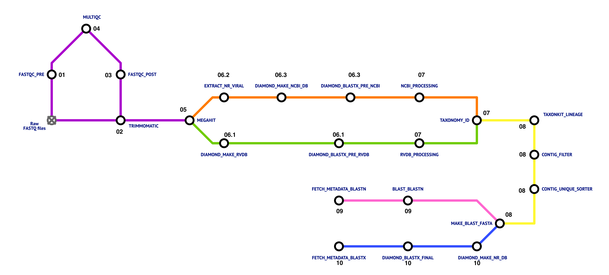

# VDM_workshop_2025_practical
Virus discovery pipeline 

#### Metagenomic Workflow: 
In this tutorial we will learn how to taxonomically classify and visualize our metagenomic reads obtained with Illumina using the following programs:

1. [Fastp](https://github.com/OpenGene/fastp)
2. [Trimmomatic](https://github.com/usadellab/Trimmomatic)
3. [MEGAHIT](https://www.metagenomics.wiki/tools/assembly/megahit)
4. [Diamond](https://github.com/bbuchfink/diamond?tab=readme-ov-file)

<figure>
    
    <figcaption>Virus discovery pipeline Workflow by Nokuzotha Nkiwane </figcaption>
</figure>


### 1. Connecting to the server to run the analysis

Using MobaXterm connect to Host: 

### 2. Setting up our folder for the analysis


```
ls
```

2. let's make a working folder
 
```
mkdir metagenomics
```

3. go in the folder

```
cd metagenomics
```

4. let's make other folders 

```
mkdir data results
```
4. let's go into data and copy our files there

```
cd data
cp xxxxxxxxxxxxxxx
```

### 3. 
