# Structural analysis tutorial
Metagenomic Virus Discovery Workshop

November 17th 2025, 
Stellenbosch, South Africa

*Spyros Lytras*


## Introduction

Metagenomic samples are full of sequences that do not match anything already described in genetic databases.
Much of this metagenomic *dark matter* may correspond to uncharacterised viruses. 
In this tutorial we will go through examples of how to use modern protein structure prediction methods
in order to detect extremely diverse viruses hiding in metagenomic samples. 

## Software requirements

### Installed locally
- [Aliview](https://ormbunkar.se/aliview/) (sequence alignment viewer)
- [ChimeraX](https://www.rbvi.ucsf.edu/chimerax/) (protein structure viewer)

### Accessed online
- [BLAST](https://blast.ncbi.nlm.nih.gov/Blast.cgi)
- [ESMfold](https://esmatlas.com/resources?action=fold)
- [AlphaFold2](https://colab.research.google.com/github/sokrypton/ColabFold/blob/main/AlphaFold2.ipynb)
- [AlphaFold3](https://alphafoldserver.com/)
- [Foldseek](https://search.foldseek.com/search)


## Main task

You are given a protein sequence of interest that you found in high abundance within your metagenomic sequencing dataset.
You would like to identify what this protein sequence corresponds to. 

First access the sequence provided in [this fasta file](maintask_data/unknown_peptide.fasta).
You can have a look at what the sequence looks like using Aliview. 

Let's start by trying to identify what this sequence may be using sequence
homology detection methods. Try to use protein [BLAST](https://blast.ncbi.nlm.nih.gov/Blast.cgi)
to see if the sequence matches anything in the Genbank database.

	Do you get any hits?

<br>


### Protein structure prediction

Even if the nucleotide and the translated amino acid sequences are too diverse to detect similarity 
with characterised sequences, the 3D structure of the protein may retain a greater level of 
conservation, showing similarity to known, homologous protein structures. 

To search for homologs on the structural level, however, we first need to get a good prediction of 
what the structure of the protein at hand looks like. 

We will try using four different ways for predicting the protein structure and compare which one performs best in this case.


#### ESMfold (pLM-based)

This is by far the fastest prediction method, suitable for high-throughput prediction of 
short protein monomers, although the prediction quality is not always very high. 

The ESMfold software can be run locally ([see details here]()) but the most convenient 
way to use it is through the ESMatlas website. 

Visit the *Fold* resource of the [ESMatlas website](https://esmatlas.com/resources?action=fold).

Paste your amino acid sequence into the input box and click the prediction button as shown below:

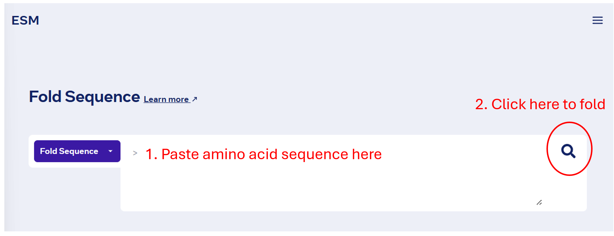


The prediction should finish very quickly and displayed on your browser.

Click the *PDB file* button to download the predicted structure.

	Note: Try to use a consistent file naming scheme, e.g. `unknown_peptide-ESMfold.pdb`.

#### AlphaFold2

AlphaFold2 is probably the most popular structure prediction method,
heavily relying on providing a good multiple sequence alignment (MSA) of protein sequences
related to the sequence the structure of which you're trying to predict.

We can run AlphaFold2 online using its open-sourse implementation
called [ColabFold](https://github.com/sokrypton/ColabFold).

The following [Google colab notebook](https://colab.research.google.com/github/sokrypton/ColabFold/blob/main/AlphaFold2.ipynb)
can run through the full prediction pipeline of ColabFold, including creating
the input MSA for you. 

You can have a look at each cell of the notebook by running each cell separately
or click `Runtime` -> `Run all` once you have filled in
at least the `query_sequence` field:

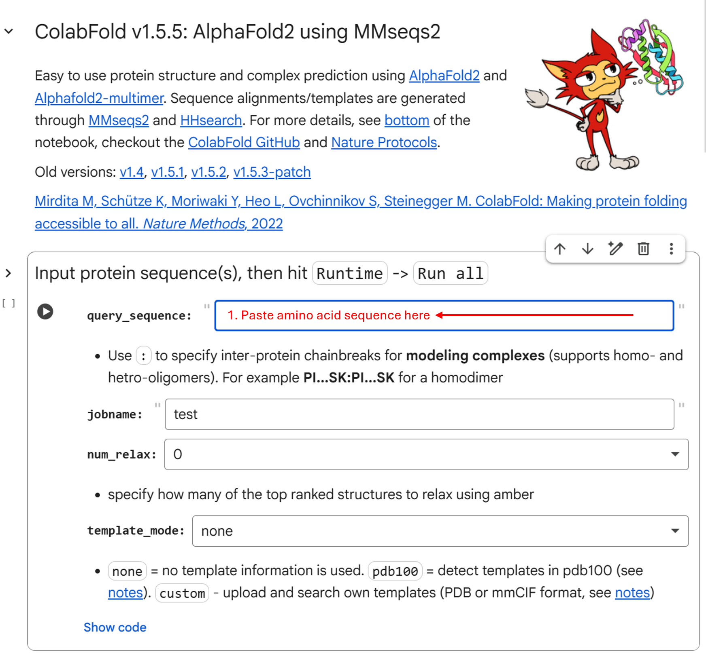

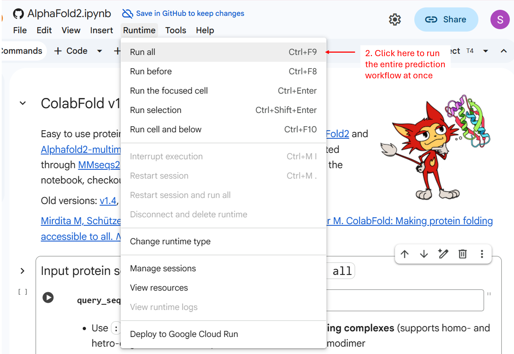

Some options to consider:

- enabling the template mode, in case related protein structures are available in the pdb database
- enabling relaxation of the best structure prediction (may improve the final result, but adds an extra step)
- increasing the number of recycles (may improve prediction for harder tasks)

	What is the confidence (plDDT) of the predicted structure?

	Have a look at the plots created in the notebook. 

Once the prediction is finished a `.zip` file with the results should be downloaded automatically
from your browser.


#### AlphaFold2 (custom alignment)

As mentioned above, the prediction quality of AlphaFold2 is highly
dependent on the depth of the input MSA (i.e., how many related protein
sequences are present in the alignment). 

In your `.zip` results folder downloaded in the above section you will find
a `.a3m` fle which contains the input MSA automatically made by the ColabFold
workflow. Open this file in a text editor, how many related sequences are there?

We also have a [custom MSA file](task1_data/unknown_peptide_aln.a3m) available containing metagenomically assembled 
protein sequences related to the query sequence which are not available in the 
public databases searched by ColabFold. 

Can you try rerunning the ColabFold notebook prediction, but this time select
`custom` in the MSA options cell: 

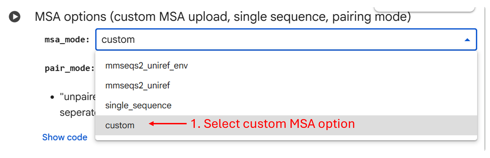

Once you run this cell with the `custom` option selected, a `Choose Files` box will appear:

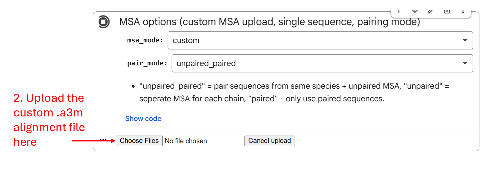

Click it and upload the custom `.a3m` MSA file and continue with the prediction as in the previous section.


	Are there any noteable differences in the results?


#### AlphaFold3

The final method we will use is the latest model in the AlphaFold family: [AlphaFold3](https://github.com/google-deepmind/alphafold3)

This method is less dependent on the input alignment and contains a more complex model that 
can handle predicting interaction between multiple proteins, nucleotides, and ligands.

For the purposes of this tutorial we will only use AlphaFold3 to predict the monomer
structure of our unknown peptide sequence. 

The easiest way to run AlphaFold3 is through [Google's AlphaFold Server](https://alphafoldserver.com/).

You first need to log in with a Google account and accept the terms of use:

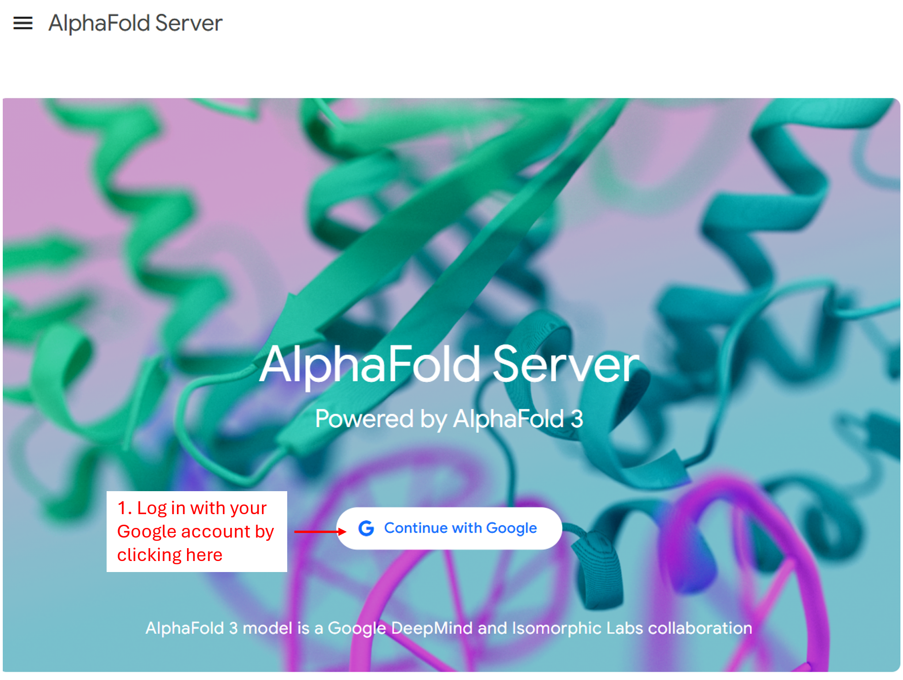

Once you log in you can submit a limited number of prediction jobs per day (usually 30) as shown below:

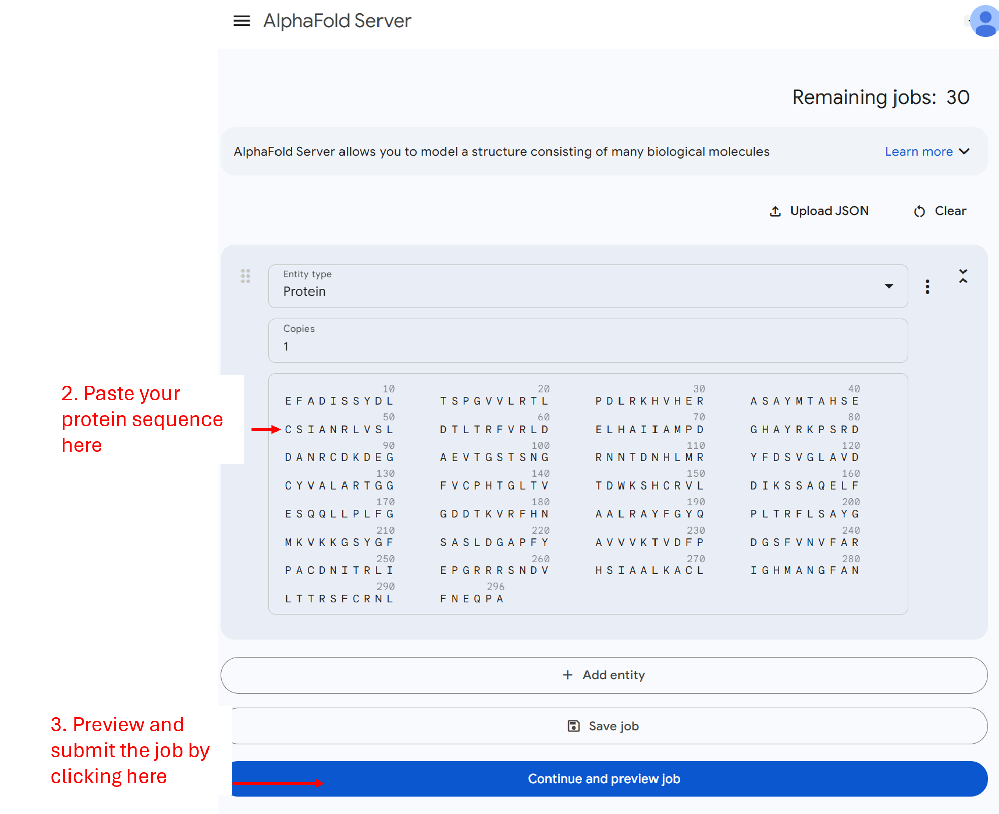


When the job is finished you can click on it from the list of jobs and
then click download to retrieve the data:

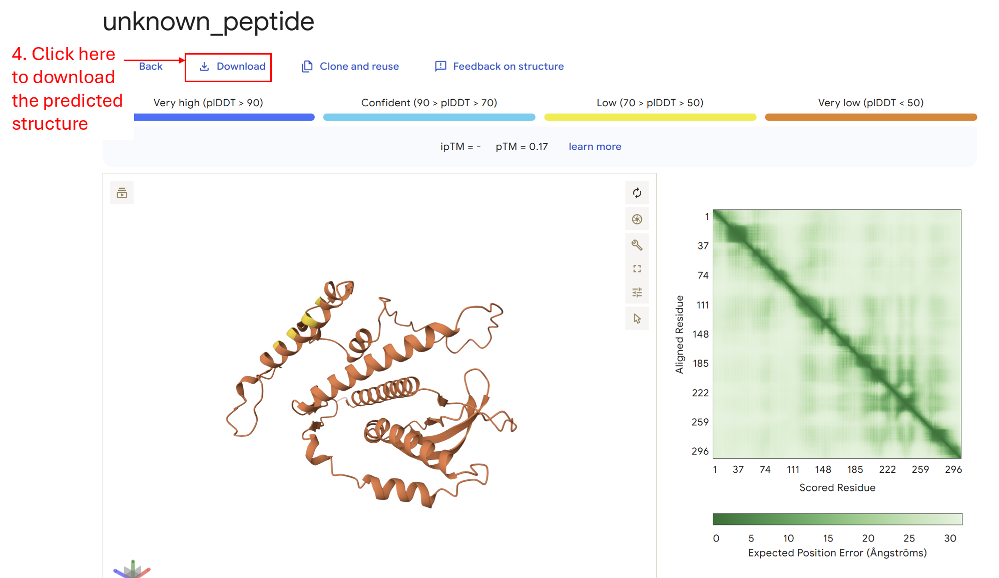

<br>

### Visualisation of predicted structures

Now we can compare all the four predicted structures of the same query sequence.

We will visualize these using the [UCSF ChimeraX](https://www.rbvi.ucsf.edu/chimerax/) software.
This can be done with various pieces of software, a notable alternative being [PyMOL](https://www.pymol.org/).

First let's open ChimeraX and click the `Open` button on the top left and select all four predicted structures. 
These should be: 

- the ESMfold `.pdb` file
- the default AlphaFold2 `rank001` model `.pdb` file
- the custom MSA AlphaFold2 `rank001` model `.pdb` file
- the AlphaFold3 `model_0` model `.cif` file

Before starting to properly look at our structures have a look at the ChimeraX interface:

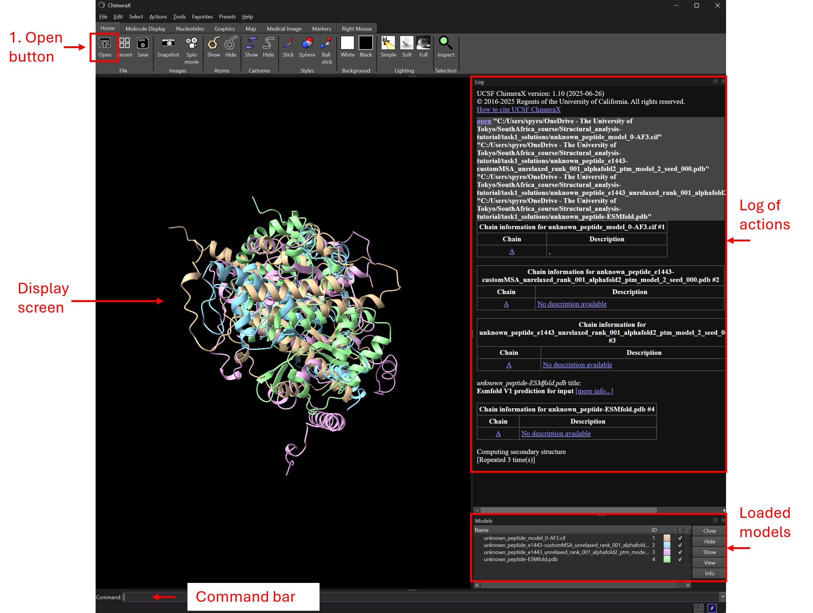

The software has a number of GUI buttons to perform multiple tasks, 
however it also includes a command line bar at the bottom for performing 
more complex functions or automating series of commands.

Let's separate the four structures which are all currently in the centre of the
visualisation window by running the following command on the command line bar:

```
tile
```

You will also notice that the structures are not positioned in the same orientation.
We can use the `matchmaker` method implemented in ChimeraX to superimpose the structures' orientations
by clicking on `Tools` -> `Structure Analysis` -> `Matchmaker`

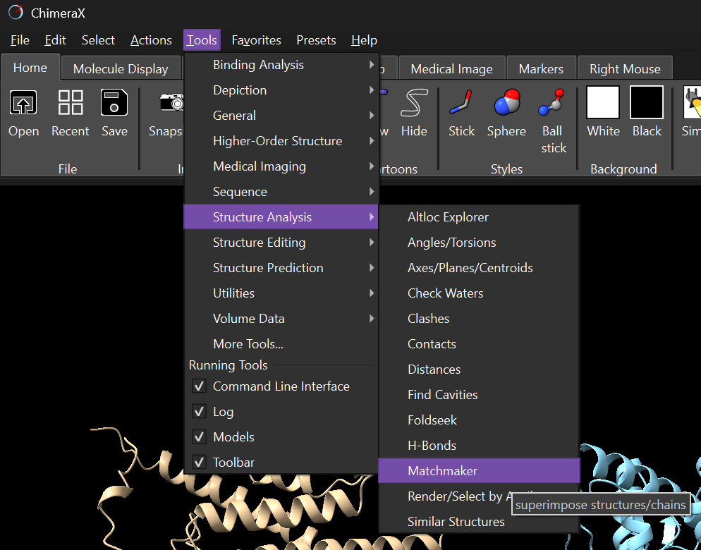

Select one of your four models as the `Reference structure` (could be any in this case) and the other three
as the `Structures to match` and click 	`OK`	

Do the four structures look similar or different to one another? 

All four structure files contain prediction confidence annotations.
These are the plDDT values we examined above, annotated for each residue
in the structure. You can visualise per residue confidence in the commonly used
'alphafold' colourscheme (red to blue) using the following ChimeraX command:

```
color by bfactor palette alphafold
```

Which structure is predicted with the highest confidence?

<br>

### Structure-based homology detection

Now that we have predicted the structure of our unknown protein sequence
using different methods and inspected the corresponding structure predictions
it's time to put them to good use and figure out if structural homology can 
tell us more about where this protein may be coming from. 

To do this, we will use the [Foldseek](https://github.com/steineggerlab/foldseek) method,
implemented in its [online protein structure search server](https://search.foldseek.com/search).

Foldseek works conceptually like BLAST, but instead of using a sequence query to 
match database entries in a pairwise manner by sequence similarity, it uses a structure query
to match entries in a structure database by structural similarity.

Before using our predicted structures to search we can try another function of
the Foldseek server, which is using the [ProstT5 protein language model](https://github.com/mheinzinger/ProstT5) to
predict a 3Di representation of our protein's structure. This allows Foldseek to still
search the structure database without requiring to predict the actual structure
of the protein. This function is very fast but not always as accurate as a good structure prediction.
Try it as shown below:

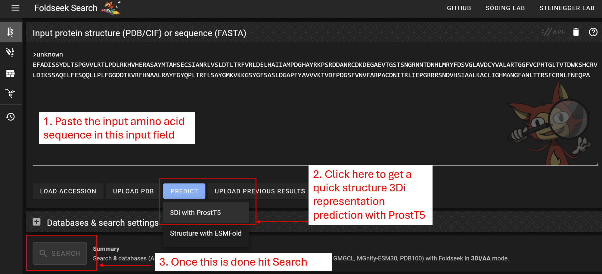

Do you get any confident hits? Make sure you have a look at the `Prob.` and `E-Value` columns of the results.
Are these hits confident or more likely false positives?

Now let's try again with the four predicted structures by going back to the Foldseek Search
page and clicking `UPLOAD PDB` before hitting the `SEARCH`.

Which predicted structure do you expect to have the most confident hits?

<br>

**What do you make of the results? Where does the unknown peptide come from?**

If you have a confident hit you can download it and view it in ChimeraX together with 
the query predicted structure.

<br>

## Bonus task

Here is a bonus task for those who want to master their structure analysis skills!

The [Hangzhou ochthera mantis flavivirus 1](https://www.ncbi.nlm.nih.gov/protein/UHR49738.1/)
is a metagenomically discovered diverse member of the *Flaviviridae*. 
The virus encodes a single polyprotein that is then cleaved to produce 
all the mature peptides that the virus uses to enter cells, replicate, and 
perform its lifecycle. 

If you have a look at the [Genbank file](https://www.ncbi.nlm.nih.gov/protein/UHR49738.1/) 
for the virus polyprotein, some mature peptides have been annotated based on sequence
homology to other known viruses. These include the helicase, peptidase and polymerase but
what's missing from the annotation is the virus glycoprotein, necessary for cellular entry. 

Using the techniques you learned during the [Main task](), can you figure out
which part of the Hangzhou ochthera mantis flavivirus 1 polyprotein contains
the virus glycoprotein and what this glycoprotein looks like? 


## Extra reading

- Hou *et al.* (2024) **Using artificial intelligence to document the hidden RNA virosphere.**
*Cell*, doi: [10.1016/j.cell.2024.09.027](https://doi.org/10.1016/j.cell.2024.09.027)

- van Kempen *et al.* (2024) **Fast and accurate protein structure search with Foldseek.**
*Nature Biotechnology*, doi: [10.1038/s41587-023-01773-0](https://doi.org/10.1038/s41587-023-01773-0)

- Mifsud *et al.* (2024) **Mapping glycoprotein structure reveals Flaviviridae evolutionary history.**
*Nature*, doi: [10.1038/s41586-024-07899-8](https://doi.org/10.1038/s41586-024-07899-8)

## Special thanks to...

... The [RdRp Summit 2025](https://rdrp.io/rdrp-summit-2025-was-held-in-lisbon-portugal/) (Lisbon, Portugal, May 11-12) participants and specifically Dr. Xin Hou (Institut Pasteur) for discussions
and valuable work that formed the basis of this tutorial.

	